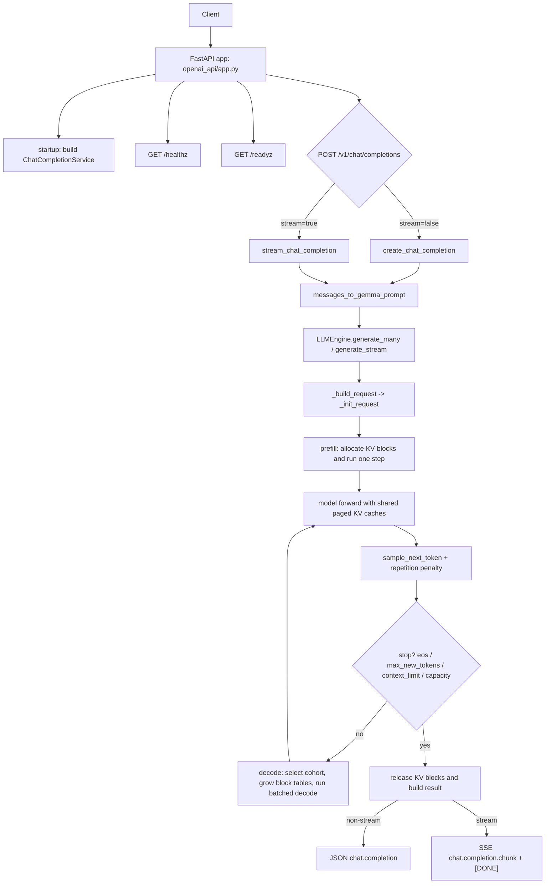

# Gemma 3 270M: Readable Minimal Implementation

This repository is a clean, minimal PyTorch implementation of Gemma-3-style inference, built to be easy to read and extend.

## Purpose

Provide a small, understandable codebase for:
- decoder-only model inference with block-based paged KV cache
- continuous multi-request scheduling with prefill/decode batching
- an OpenAI-compatible local chat API with readiness-aware startup

## Technical Scope

- Model: `gemma-3-270m` and `gemma-3-270m-it` checkpoints
- Current runtime target: `choose_model="270m"`
- Architecture: 18-layer decoder with mixed `sliding_attention` + `full_attention`
- Attention stack: GQA, RoPE (local/global bases), causal + optional sliding-window mask
- Normalization/MLP: Gemma-style RMSNorm and gated feedforward (`down(gelu(gate(x)) * up(x))`)
- Engine: single-device prefill/decode scheduler with round-robin decode, decode-step batching, and block-based paged KV allocation
- API: FastAPI app compatible with `POST /v1/chat/completions` plus `GET /healthz` and `GET /readyz`

## Install

```bash
python -m pip install torch tokenizers safetensors huggingface_hub fastapi uvicorn pydantic starlette
```

Model access note:
- You need approved access to Gemma checkpoints (for example `google/gemma-3-270m` / `google/gemma-3-270m-it`) before first download.
- If local model files already exist in `gemma-3-270m/` or `gemma-3-270m-it/`, they are reused.

Optional benchmark dependency:

```bash
python -m pip install pandas
```

## Run

Direct generation:

```bash
python main.py
```

OpenAI-like API server:

```bash
python -m openai_api.run
```

Query the API:

```bash
python query_fastapi.py --stream --prompt "Give me one short line about LLM inference."
```

## Project Structure

- `gemma3/`: model components, paged KV storage, RoPE, feedforward, and weights mapping
- `engine/`: runtime, sampling, block-based KV allocator, and request scheduler
- `openai_api/`: FastAPI app, schemas, prompting, and chat service
- `main.py`: direct local generation flow
- `tests/`: scheduler and API response-shape tests

## Engine Configuration

The scheduler now allocates KV memory in blocks as requests grow, rather than reserving an entire request budget up front.

- `max_kv_cache_tokens`: total KV token budget available to the engine
- `kv_block_size`: size of each KV allocation block
- `num_kv_blocks`: optional explicit number of blocks; if omitted, it is derived from `max_kv_cache_tokens // kv_block_size`

This keeps the engine readable while matching the basic vLLM-style idea: admit requests cheaply, grow cache usage incrementally, and free blocks immediately when a request finishes.

## API Operations

- `GET /healthz`: lightweight liveness probe
- `GET /readyz`: readiness probe; returns `200` only after `ChatCompletionService` has loaded successfully
- `GET /metrics`: lightweight runtime counters for active/queued requests, request outcomes, and KV block usage
- `POST /v1/chat/completions`: returns `503` if service startup failed or is not yet complete

The API keeps a bounded admission queue in front of the single engine instance. If the queue is full, requests fail fast with `429` instead of waiting indefinitely. Streaming responses release their admission slot when the stream completes, errors, or is closed by the client.

## Supported Reliability Scope

This project intentionally stays smaller than vLLM:

- single process, single engine instance, single device
- bounded API admission instead of a distributed request router
- paged KV allocation with immediate block release on finish
- chunked prefill and decode batching, but no preemption scheduler
- no tensor parallelism, speculative decoding, prefix caching, or multi-node serving

The goal is to make correctness and failure modes easy to inspect before adding throughput-oriented features.

The API now initializes `ChatCompletionService` during app startup, so model load and download failures surface at boot instead of on the first request.

## Request Flow



## Validation

```bash
python -m unittest discover -s tests -q
```

Scheduler tests cover round-robin decode ordering, paged KV isolation between requests, and block-capacity reuse / deferral.

Real `LLMEngine` regression tests (uses actual model/runtime, opt-in):

```bash
RUN_REAL_ENGINE_TESTS=1 python -m unittest -q tests/test_llmengine_regression_real.py
```

Real `LLMEngine` load tests (opt-in and heavier):

```bash
RUN_REAL_ENGINE_TESTS=1 RUN_REAL_ENGINE_LOAD_TESTS=1 python -m unittest -q tests/test_llmengine_load_real.py
```

Load threshold overrides (optional):
- `LOAD_MAX_ERROR_RATE`
- `LOAD_MAX_P95_TOTAL_S`
- `LOAD_MIN_THROUGHPUT_TPS`
