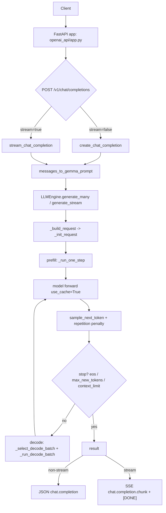

# Gemma 3 270M: Readable Minimal Implementation

This repository is a clean, minimal PyTorch implementation of Gemma-3-style inference, built to be easy to read and extend.

## Purpose

Provide a small, understandable codebase for:
- decoder-only model inference with KV-cache
- simple multi-request scheduling
- an OpenAI-compatible local chat API

## Technical Scope

- Model: `gemma-3-270m` and `gemma-3-270m-it` checkpoints
- Current runtime target: `choose_model="270m"`
- Architecture: 18-layer decoder with mixed `sliding_attention` + `full_attention`
- Attention stack: GQA, RoPE (local/global bases), causal + optional sliding-window mask
- Normalization/MLP: Gemma-style RMSNorm and gated feedforward (`down(gelu(gate(x)) * up(x))`)
- Engine: single-device prefill/decode scheduler with round-robin decode and decode-step batching
- API: FastAPI endpoint compatible with `POST /v1/chat/completions` (streaming + non-streaming)

## Install

```bash
python -m pip install torch tokenizers safetensors huggingface_hub fastapi uvicorn pydantic starlette
```

Model access note:
- You need approved access to Gemma checkpoints (for example `google/gemma-3-270m` / `google/gemma-3-270m-it`) before first download.
- If local model files already exist in `gemma-3-270m/` or `gemma-3-270m-it/`, they are reused.

Optional benchmark dependency:

```bash
python -m pip install pandas
```

## Run

Direct generation:

```bash
python main.py
```

OpenAI-like API server:

```bash
python -m openai_api.run
```

Query the API:

```bash
python query_fastapi.py --stream --prompt "Give me one short line about LLM inference."
```

## Project Structure

- `gemma3/`: model components (attention, RoPE, feedforward, weights mapping)
- `engine/`: runtime, sampling, and request scheduler
- `openai_api/`: FastAPI app, schemas, prompting, and chat service
- `main.py`: direct local generation flow
- `tests/`: scheduler and API response-shape tests

## Request Flow



## Validation

```bash
python -m unittest discover -s tests -q
```

Real `LLMEngine` regression tests (uses actual model/runtime, opt-in):

```bash
RUN_REAL_ENGINE_TESTS=1 python -m unittest -q tests/test_llmengine_regression_real.py
```

Real `LLMEngine` load tests (opt-in and heavier):

```bash
RUN_REAL_ENGINE_TESTS=1 RUN_REAL_ENGINE_LOAD_TESTS=1 python -m unittest -q tests/test_llmengine_load_real.py
```

Load threshold overrides (optional):
- `LOAD_MAX_ERROR_RATE`
- `LOAD_MAX_P95_TOTAL_S`
- `LOAD_MIN_THROUGHPUT_TPS`
